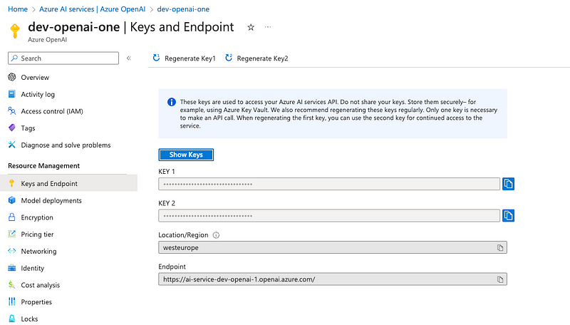
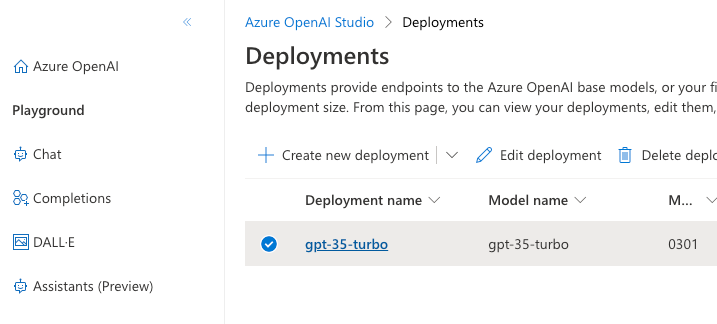

## Context


## Architecture

## Bootstrap the Terraform 
Create an Azure Storage Account to store your Terraform State files. These actions should be run locally.

1. Set the Terraform Bootstrap Environment Variables

    (a) Copy the env.sh file to env.local.sh

    (b) Fill out the following environment variables
    example:
    ```bash
    # Path 
    export TERRAFORM_PATH=terraform

    # Terraform Backend Bootstrap and Init 
    export TERRAFORM_BACKEND_TENANT_ID="00000000-0000-0000-0000-000000000000"
    export TERRAFORM_BACKEND_SUBSCRIPTION_ID="00000000-0000-0000-0000-000000000000"
    export TERRAFORM_BACKEND_LOCATION="uksouth"
    export TERRAFORM_BACKEND_RESOURCE_GROUP="test-rg"
    export TERRAFORM_BACKEND_STORAGE_ACCOUNT="testsa"
    export TERRAFORM_BACKEND_STORAGE_ACCOUNT_SKU="Standard_LRS"
    export TERRAFORM_BACKEND_CONTAINER="teststatefiles"
    export TERRAFORM_BACKEND_STATE_FILE="test-state"
    export TERRAFORM_SERVICE_PRINCIPAL="test-terra-sp"
    ```
    (c) Set the environment variables in your terminal 
    ```bash
    source env.local.sh
    ```

2. Bootstrap Terraform 
    ```bash
    make terra-bootstrap
    ```
    > Note: Log into Azure when prompted 
    > Note: Make a note of the output of this script after: "For env.local.sh..."

## Deploy the Terraform
This will deploy the Infrastructure to your Azure account from your local machine.

1. Following the 'Bootstrap the Terraform' steps above
   
2. Set the Terraform Environment Variables

   (a) Update the env.local.sh file
    The script above outputs your terraform variables. Add these into your env.local.sh file.
    Update the ARM_SUBSCRIPTION_ID with the ID of Subscription you want to deploy your resources into.
   
    example:
    ```bash
    export ARM_CLIENT_ID="00000000-0000-0000-0000-000000000000"
    export ARM_CLIENT_SECRET="00000000-0000-0000-0000-000000000000"
    export ARM_TENANT_ID="00000000-0000-0000-0000-000000000000"
    export ARM_SUBSCRIPTION_ID="00000000-0000-0000-0000-000000000000"
    export ARM_ACCESS_KEY="00000000-0000-0000-0000-000000000000"
    ```

    (b) Set the environment variables in your terminal
    ```bash
    source env.local.sh
    ```

3. Update the Terraform Code

   (a) Update the _terraform.tfvars_ file with your values 


4. Initialise Terraform 
    ```go
    make terra-init
    ```

5. Plan Terrafrom 
    ```go
    make terra-plan
    ```

6. Apply Terraform 
    ```go
    make terra-apply
    ```

7. To destroy your Infrastructure 
    ```go
    make terra-destroy
    ```

## Bootstrap and Run the Application
1. Following the 'Deploy the Terraform' steps above

2. From the Azure Portal get the Endpoint, Keys and the Deployment Model name. 
   
   

3. Set the Terraform Environment Variables

   (a) Update the env.local.sh file   
    example:
    ```bash
    export AZURE_OPEN_AI_ENDPOINT=""
    export AZURE_OPEN_AI_API_KEY=""
    export AZURE_OPEN_AI_DEPLOYMENT_MODEL=""
    ```

    (b) Set the environment variables in your terminal
    ```bash
    source env.local.sh
    ```

4. Bootstrap Application 
    ```go
    make app-bootstrap
    ```

5. Run the Application 
   ```go
    make app-bootstrap
    ```

## Test the Application
1. While the application is running open a new terminal

2. Run the following curl command
   ```bash
    curl -L \
    -H "Accept: application/json" \
    -H "Connection: close" \
    -H "Content-type: application/json" \
    -X POST -d '{"input": "write a random 100 word paragraph"}' \
    http://127.0.0.1:8000/stream --no-buffer \
    --verbose 
    ```
    > Note: You can change the input prompt
    > Note: You may have to change the application IP address depending on what host it is binded to
